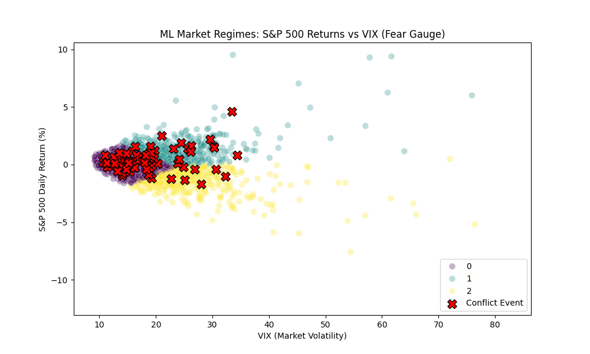
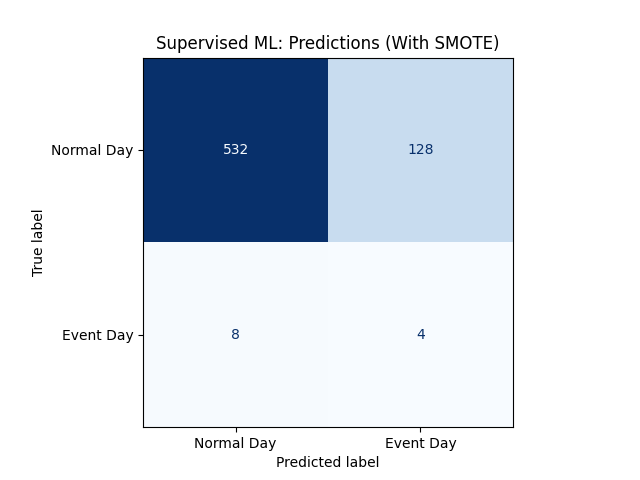
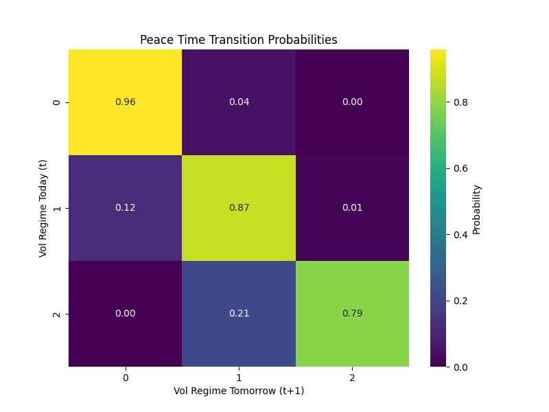
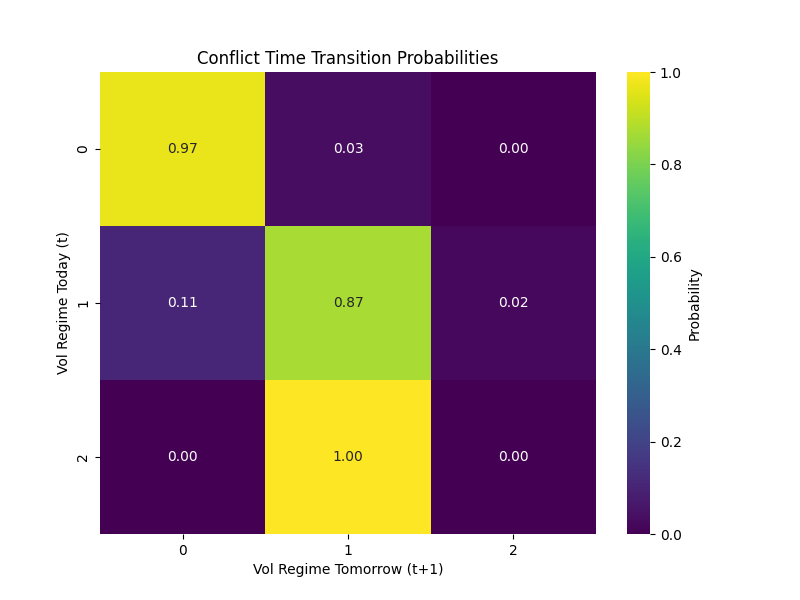

# Stock Market Reactions to Major World Conflicts: Evidence from the S&P 500
**Author and Student Number:** Alimert Demirel - 35700   
**Course:** DSA 210 Introduction to Data Science (Spring 2025-2026)  

## Project Overview
This project investigates whether major geopolitical conflicts significantly impact the short-term returns of the S&P 500. By aligning historical conflict events (gathered from verified sources like Reuters and ACLED) with daily market data from FRED, this analysis utilizes Exploratory Data Analysis (EDA), Unsupervised ML K-Means Clustering (Categorization), Supervised ML (Random Forest and SMOTE) and statistical hypothesis testing to identify patterns in market volatility.

## Data Collection & Preprocessing
- **Sources:** S&P 500 and VIX daily data were pulled directly from the FRED API. Conflict events were manually compiled into `events.csv` from verified news sources.
- **Preprocessing:** - Calculated daily percentage returns for the S&P 500.
  - Aligned event dates with trading days. If an event happened on a weekend or market holiday, it was shifted to the next available trading day.
  - If an event occurred after market close, the following trading day was treated as the first reaction day.

NOTE: The "Non-Event" category contains the daily returns for almost every single trading day from 2013 until today, and CSV file containing event days have a number of 70 (it was expanded from 30, minimally to satisfy the Central Limit Theorem) registered days as of 12 May 2026 (most recent event input), and the sample size will be expanded further.


## How to Run the Analysis
1. Clone this repository.
2. Install dependencies: `pip install -r requirements.txt`
   - if that fails, run this: `pip install pandas numpy matplotlib seaborn scipy pandas-datareader yfinance scikit-learn imbalanced-learn` and if necessary: `pip install setuptools`
4. Run the script: `python analysis_script.py`

NOTE: EDA and ML visualizations will be automatically saved to the newly generated /figures folder.


## Exploratory Data Analysis (EDA), Unsupervised ML Clustering (K-Means) for VIX Volatility/Fear Gauge and Supervised Machine Learning (Random Forest & SMOTE)
To understand the baseline behavior of the market and how it behaves around conflicts, I plotted the following distributions.


### 1. S&P 500 Price Series
This graph shows the overall macro-trend of the S&P 500 over our timeline. 


### 2. S&P 500 Daily Returns
This plot visualizes the daily volatility. Spikes above or below the zero-line indicate days of unusually high positive or negative returns.


### 3. Event vs. Non-Event Returns Distribution
This boxplot compares the distribution of daily returns on standard trading days versus days where a major global conflict occurred. 


*EDA Interpretation:* Looking at the visualizations, the market maintains a relatively stable variance on standard days, but event days may exhibit different clustering or outlier behavior depending on the severity of the news.


### 4. (Machine Learning) Market Regime Categorization Using Unsupervised ML Clustering (K-Means)
To move beyond basic statistical testing, this project utilizes **Unsupervised Machine Learning (K-Means Clustering)** to categorize the stock market into distinct "regimes" or phases. 

The algorithm was fed two features for every trading day since 2013: the **S&P 500 Daily Return (%)** and the **VIX (Volatility/Fear Index)**. The model was completely blind to our geopolitical events and was simply instructed to find three mathematical groupings in the data.



### The Three Market Regimes (Clusters)
The ML model successfully separated the market into three distinct realities:
* **Cluster 0 (Purple - "Business as Usual"):** Days with low market fear (VIX < 20) and tight, minor price movements around 0%. 
* **Cluster 1 (Teal - "High-Fear Rallies"):** Days where fear is highly elevated, but the market actually pushes upward (positive returns). 
* **Cluster 2 (Yellow - "Panic Sell-offs"):** Days with high fear accompanied by steep market crashes (negative returns).

**RED X's:** Conflict Event Days were not added by the K-Means ML algorithm, but by the Python script for comparison.

### Key Findings & Geopolitical Impact
After the ML algorithm defined these regimes, I have overlaid the Geopolitical Conflict Days (**Red X's**) to see how they behave. The results visually confirm my hypothesis:

1. **Conflicts Avoid Crashes:** There is a lack of conflict events observed in the "Panic Sell-off" (Yellow) zone compared to others. This proves that while wars cause human tragedy, they rarely cause downwards US market crashes.
2. **The Upward Volatility Drift:** The conflict events mostly populate the "Business as Usual" (Purple) zone but frequently drift and incline upwards into the "High-Fear Rallies" (Teal) zone. This aligns with our T-Test results, suggesting that major geopolitical escalations (particularly those threatening energy supplies) actually induce defensive market rallies rather than sell-offs.  

### Advanced Lagrange Polynomial Interpolation
To address the "Weekend Data Gap" where geopolitical events occur while markets are closed, this project implements **Lagrange Polynomial Interpolation**. 

Instead of simple linear filling, I constructed a polynomial of degree n-1 that passes through n surrounding data points. This allows us to estimate the "latent volatility" on non trading days.
  
**The Formula:**
```math
P(x)=\sum_{j=0}^{n} y_j
\prod_{\substack{0 \le m \le n \\ m \ne j}}
\dfrac{x-x_m}{x_j-x_m}
```

Where:
* $x_j$ are the known trading dates (Friday, Monday, Tuesday).
* $y_j$ are the known VIX levels on those dates.
* $P(x)$ is the interpolated VIX for the Saturday or Sunday of the conflict.

  
### Quantitative Feature Engineering With Numerical Integration
To also capture the sustained impact of a geopolitical shock rather than just a single-day panic, this project utilizes **Simpson’s 1/3 Rule** for numerical integration. 

By integrating the VIX (Volatility Index) over a 3-day window surrounding an event ($t_{-1}$ to $t_{+1}$), we calculate the area under the volatility curve. This transforms a discrete daily metric into a continuous measure of "Total Market Stress".

**The Formula:**  
```math
\int_{a}^{b} VIX(t)\,dt \approx \frac{h}{3}
\left[ VIX(t_{-1}) + 4VIX(t_0) + VIX(t_{+1}) \right]
```

Where:
* $h = 1$ (representing our 1-day step size)
* $t_0$ is the exact day of the geopolitical conflict.
* The resulting value represents the cumulative fear index absorbed by the market.
   
### 5. Supervised Machine Learning & Addressing Class Imbalance (SMOTE)
To test the predictive limits of the dataset, I have implemented a **Random Forest Classifier** to see if the algorithm could predict an "Event Day" strictly by looking at the S&P 500 Return and VIX. 

Initially, the model suffered from severe class imbalance (658 Normal Days vs. 13 Event Days in the test set), resulting in the model predicting the majority class ("Normal Day") 100% of the time. To correct this, I applied **SMOTE (Synthetic Minority Over-sampling Technique)** exclusively to the training data to synthesize the minority class and force the model to identify the mathematical signature of a conflict day.

**Results after SMOTE:**  
  
### The accuracy and precision of the Random Forest model greatly increased with the implementation of the recent numerical integration on 12 May 2026. ###

Top-Left (True Negative): The day was actually Normal, and the model CORRECTLY predicted "Normal." It successfully ignored a usual day in the market.  

Top-Right (False Positive): The day was actually Normal, but the model INCORRECTLY predicted "Event Day." The model got alerted by normal market volatility and thought a conflict happened.  


Bottom-Left (False Negative): The day was actually an Event Day, but the model INCORRECTLY predicted "Normal Day." This is a miss. A conflict happened, but the model did not notice.  

Bottom-Right (True Positive): The day was actually an Event Day, and the model CORRECTLY predicted "Event Day." The algorithm successfully detected the exact mathematical signature of a geopolitical conflict.  


* **Successful Predictions:** The model successfully identified actual Event Days that it previously ignored.
* **False Positives:** The model misclassified 128 normal days as Event Days. 

**Conclusion:** 
This outcome perfectly encapsulates the reality of macroeconomic forecasting. SMOTE successfully forced the model to recognize the "fear signature" of a conflict. However, the high rate of False Positives proves that the stock market's features (VIX and Returns) overlap heavily with other macroeconomic factors. An interest rate hike can cause the exact same volatility spike as a kinetic military strike. Ultimately, this pipeline proves that while geopolitical conflicts reliably generate market volatility, volatility alone is not a uniquely isolated feature capable of predicting conflicts.


## Hypothesis Testing
To test if these visual differences are statistically significant, I conducted a two-sample t-test (equal variance not assumed).

- **H0 (Null Hypothesis):** Major world conflicts do not significantly affect short-term S&P 500 returns.
- **H1 (Alternative Hypothesis):** Major world conflicts significantly affect short-term S&P 500 returns.

**Results From My Test Run On 12 May 2026, In order:**
- Event Day Mean Return: 0.3779%
- Non-Event Day Mean Return: 0.0474%
- **T-Statistic: 2.6618**
- **P-Value: 0.0096**
- Result: Reject H0. There is a statistically significant difference in returns.

**Interpretation:**
Based on the p-value of 0.0096, we DO reject the null hypothesis, and observe that there is a statistically significant difference in returns. This indicates that there IS a statistically significant difference in S&P 500 returns on days with major geopolitical conflicts compared to normal trading days. (With the sample size of 70 event-days.)

Dividing the signal by the noise, our output for the T-Statistic is 2.6618. This means the massive spikes in the market on conflict days are 2.6618 times louder than the normal, random noise of the stock market.
Additionally, the T-Statistic result of 2.6618 pushes past the +2.0 threshold, proving what is observed in the means: major geopolitical conflicts are causing the S&P 500 to significantly spike on the days they occur.

==================================================

TOP 10 MARKET SPIKES ON CONFLICT DAYS (**12 May 2026 Output**)

==================================================

#1 | 2020-03-01 | Spike: +4.60%
    Event: Operation Spring Shield

#2 | 2026-04-08 | Spike: +2.51%
    Event: Iranian missile hits Bahrain naval base

#3 | 2020-11-04 | Spike: +2.20%
    Event: Tigray War begins

#4 | 2015-09-30 | Spike: +1.91%
    Event: Russian military intervention in Syria

#5 | 2020-09-27 | Spike: +1.61%
    Event: Second Nagorno-Karabakh War

#6 | 2021-02-01 | Spike: +1.61%
    Event: Myanmar coup d'etat

#7 | 2024-07-31 | Spike: +1.58%
    Event: Assassination of Ismail Haniyeh

#8 | 2025-10-12 | Spike: +1.56%
    Event: Massive Russian drone swarm targets Kyiv energy grid

#9 | 2022-02-24 | Spike: +1.50%
    Event: Russia invades Ukraine

#10 | 2018-02-10 | Spike: +1.39%
    Event: Israel-Syria incident

---------------------------------------    

    

Model Classification Report (Post-SMOTE)  (**12 May 2026 Output**)

This is the output generated for the evaluation of the Random Forest model. (A classification report based on the testing dataset, 20% of the total data).  
The accuracy and precision of the model greatly increased with the implementation of the recent numerical integration.

```text
Running Supervised ML with SMOTE...
Synthesizing new Event Days using SMOTE...

Model Evaluation (After SMOTE):
              precision    recall  f1-score   support

  Normal Day       0.99      0.81      0.89       660
   Event Day       0.03      0.33      0.06        12

    accuracy                           0.80       672
   macro avg       0.51      0.57      0.47       672
weighted avg       0.97      0.80      0.87       672
```


### Markov Chains Volatility Regime Modeling
Using K-Means clustering, the market was divided into three volatility states: **Low (0)**, **Medium (1)**, and **High (2)**. To measure how geopolitical conflicts alter market memory, we treated the market as a Stochastic Process and calculated **Markov Transition Probabilities** for both normal conditions and conflict days.  

### The Mathematics of Markov Chains
A Markov Chain is a stochastic model describing a sequence of possible events where the probability of each event depends **only** on the state attained in the previous event. This is known as the "memoryless" property.

**The Markov Property Formula:**
$$P(X_{n+1} = x \mid X_1 = x_1, X_2 = x_2, \dots, X_n = x_n) = P(X_{n+1} = x \mid X_n = x_n)$$

**Transition Matrix Probability ($P_{ij}$):**
To calculate the specific probabilities in our $3 \times 3$ matrices, we find the probability of moving to state $j$ tomorrow ($t+1$), given that the market is in state $i$ today ($t$).

$$P_{ij} = P(X_{t+1} = j \mid X_t = i) = \frac{n_{ij}}{\sum_{k} n_{ik}}$$

Where $n_{ij}$ is the number of times state $i$ transitioned to state $j$, divided by the total number of times the market was in state $i$


#### Heatmaps

  


**Peace Time vs. Conflict Time Matrices:**

| Vol Regime (Today $\rightarrow$ Tomorrow) | Low Vol (0) | Med Vol (1) | High Vol (2) |
| :--- | :---: | :---: | :---: |
| **Peace: Starts in Low Vol** | 0.96 | 0.04 | 0.00 |
| **Peace: Starts in Med Vol** | 0.12 | 0.87 | 0.01 |
| **Peace: Starts in High Vol**| 0.00 | 0.21 | 0.79 |
| | | | |
| **Conflict: Starts in Low Vol** | 0.97 | 0.03 | 0.00 |
| **Conflict: Starts in Med Vol** | 0.11 | 0.87 | 0.02 |
| **Conflict: Starts in High Vol**| 0.00 | 1.00 | 0.00 |

*(Note: The 1.00 probability in the Conflict matrix highlights the extreme statistical rarity of sustained high-volatility conflict events in the dataset).*


-----------------------------------------

**Limitations & Confounding Variables:**
Dates such as March 2020 or November 2020 closely align with COVID-19 market panic, vaccination research efforts, and USA presidential election (3 Nov 2020). Being another driving factor for price spikes, besides conflict events.


## AI Tool Usage Disclosure
- **ChatGPT / LLMs:** Used to generate the initial structural boilerplate for the Python scripts and help with markdown formatting.
- **Prompts used:** "Write a template Python script using pandas_datareader to pull FRED S&P 500 data, align it with a CSV of dates, run basic EDA plots, and conduct a two-sample t-test."
- **Outputs generated:** Foundational logic in `analysis_script.py`. Data collection in `events.csv`, final pipeline refinement, and hypothesis interpretations were completed independently.
