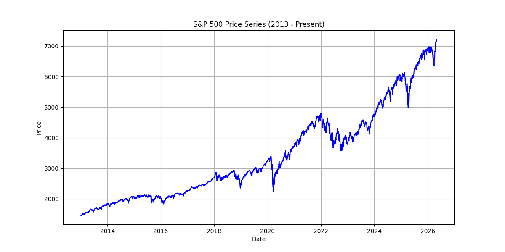
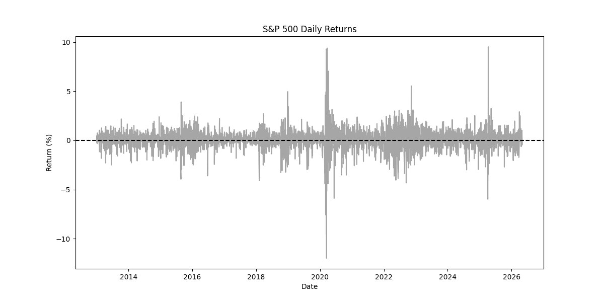
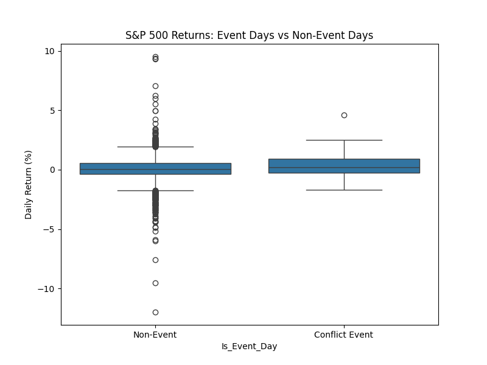

# Stock Market Reactions to Major World Conflicts: Evidence from the S&P 500
**Author and Student Number:** Alimert Demirel - 35700   
**Course:** DSA 210 Introduction to Data Science (Spring 2025-2026)  

## Project Overview
This project investigates whether major geopolitical conflicts significantly impact the short-term returns of the S&P 500. By aligning historical conflict events (gathered from verified sources like Reuters and ACLED) with daily market data from FRED, this analysis utilizes Exploratory Data Analysis (EDA) and statistical hypothesis testing to identify patterns in market volatility.

## Data Collection & Preprocessing
- **Sources:** S&P 500 and VIX daily data were pulled directly from the FRED API. Conflict events were manually compiled into `events.csv` from verified news sources.
- **Preprocessing:** - Calculated daily percentage returns for the S&P 500.
  - Aligned event dates with trading days. If an event happened on a weekend or market holiday, it was shifted to the next available trading day.
  - If an event occurred after market close, the following trading day was treated as the first reaction day.

NOTE: The "Non-Event" category contains the daily returns for almost every single trading day from 2013 until today, and CSV file containing event days have a number of 66 (it was expanded from 30, minimally to satisfy the Central Limit Theorem) registered days as of 25 April 2026 (most recent event input), and the sample size will be expanded further.

## How to Run the Analysis
1. Clone this repository.
2. Install dependencies: `pip install -r requirements.txt`
   - if that fails, run this: `pip install pandas numpy matplotlib seaborn scipy pandas-datareader yfinance` and if necessary: `pip install setuptools`
4. Run the script: `python analysis_script.py`

NOTE: EDA visualizations will be automatically saved to the newly generated /figures folder.

## Exploratory Data Analysis (EDA)
To understand the baseline behavior of the market and how it behaves around conflicts, I plotted the following distributions.

### 1. S&P 500 Price Series
This graph shows the overall macro-trend of the S&P 500 over our timeline. 

### 2. S&P 500 Daily Returns
This plot visualizes the daily volatility. Spikes above or below the zero-line indicate days of unusually high positive or negative returns.

### 3. Event vs. Non-Event Returns Distribution
This boxplot compares the distribution of daily returns on standard trading days versus days where a major global conflict occurred. 

*EDA Interpretation:* Looking at the visualizations, the market maintains a relatively stable variance on standard days, but event days may exhibit different clustering or outlier behavior depending on the severity of the news.

## Hypothesis Testing
To test if these visual differences are statistically significant, I conducted a two-sample t-test (equal variance not assumed).

- **H0 (Null Hypothesis):** Major world conflicts do not significantly affect short-term S&P 500 returns.
- **H1 (Alternative Hypothesis):** Major world conflicts significantly affect short-term S&P 500 returns.

**Results From My Test Run On 25 April 2026, In order:**
- Event Day Mean Return: 0.3883%
- Non-Event Day Mean Return: 0.0467%
- T-Statistic: 2.6428
- P-Value: 0.0103
- Result: Reject H0. There is a statistically significant difference in returns.

**Interpretation:**
Based on the p-value of 0.0103, we DO reject the null hypothesis, and observe that there is a statistically significant difference in returns. This indicates that there IS a statistically significant difference in S&P 500 returns on days with major geopolitical conflicts compared to normal trading days. (With the sample size of 66 event-days.)

Dividing the signal by the noise, our output for the T-Statistic is 2.6428. This means the massive spikes in the market on conflict days are 2.6428 times louder than the normal, random noise of the stock market.
Additionally, the T-Statistic result of 2.6428 pushes past the +2.0 threshold, proving what is observed in the means: major geopolitical conflicts are causing the S&P 500 to significantly spike on the days they occur.

## AI Tool Usage Disclosure
- **ChatGPT / LLMs:** Used to generate the initial structural boilerplate for the Python scripts and help with markdown formatting.
- **Prompts used:** "Write a template Python script using pandas_datareader to pull FRED S&P 500 data, align it with a CSV of dates, run basic EDA plots, and conduct a two-sample t-test."
- **Outputs generated:** Foundational logic in `analysis_script.py`. Data collection in `events.csv`, final pipeline refinement, and hypothesis interpretations were completed independently.
